

  

# 🤖 FOPOFO: AI 기반 자동 포트폴리오 및 챗봇 생성 서비스

  

> 본 서비스는 사용자가 자신의 다양한 파일(문서, 이미지, 동영상 등)을 업로드하면, AI가 이 중 자기소개서 및 이력서와 같은 문서들을 분석하여 개인화된 웹 포트폴리오와 대화형 챗봇을 자동 생성하는 플랫폼입니다. 생성된 포트폴리오와 챗봇은 고유 URL 및 QR 코드로 공유 가능합니다

 

## **📜 프로젝트 정보**

-   **프로젝트 기간:** 2025.07.09 ~ 2025.08.06
-   **참여 인원:** 3명
-   **🔗 배포 링크:** [https://staging.d1dbfs3o76ym6j.amplifyapp.com/](https://staging.d1dbfs3o76ym6j.amplifyapp.com/)

## **✨ 주요 기능**

-   **🤖 AI 챗봇 자동 생성:** 이력서, 자기소개서 등 개인 문서를 업로드하면, 해당 내용을 기반으로 답변하는 맞춤형 AI 챗봇이 생성됩니다.
-   **🌐 동적 웹 포트폴리오:** 업로드한 문서와 파일(이미지, 비디오, PDF)을 바탕으로 즉시 공유 가능한 개인 웹 포트폴리오 페이지를 구축합니다.
-   **🎨 테마 커스터마이징:** 생성된 포트폴리오 페이지의 폰트, 배경, 색상 등을 자유롭게 변경하여 자신만의 개성을 표현할 수 있습니다.
-   **🚀 간편한 파일 관리:** 직관적인 UI를 통해 자신의 포트폴리오를 구성하고, 마이페이지를 통해 모든 파일(이미지, 비디오, 문서 등)을 쉽게 추가/수정/삭제하고 관리할 수 있습니다.

## **🛠️ 기술 스택**

### **Frontend**
-   **`React.js`**, **`Tailwind CSS`**, **`Axios`**
-   **배포:** `AWS Amplify`

### **Backend (Node.js - API & User Service)**
-   **`Node.js`**, **`Express.js`**, **`MongoDB`**,**`AWS S3`**, **`JWT`**
-   **역할:** 사용자 인증, 파일 업로드(S3 연동), 포트폴리오 데이터 관리
-   **배포:** `AWS Elastic Beanstalk`

### **Backend (Python - AI Service)**
-   **`Python`**, **`FastAPI`**, **`LangChain`**, **`Pinecone`**, **`OpenAI`**
-   **역할:** RAG(검색 증강 생성) 기반 AI 챗봇 기능, 문서 임베딩 및 벡터 검색
-   **배포:** `Render`

## **🏛️ 시스템 아키텍처**
1.  **사용자 요청:** React 기반의 프론트엔드가 모든 사용자 요청을 받습니다.
2.  **API 서버 (Node.js):** 일반적인 요청(로그인, 파일 업로드 등)은 AWS Elastic Beanstalk에 배포된 Node.js 서버가 처리합니다. 파일은 S3에, 메타데이터는 MongoDB에 저장됩니다.
3.  **AI 서버 (Python):** 챗봇 관련 요청은 Render에 배포된 Python 서버로 전달됩니다. 이 서버는 LangChain을 통해 Pinecone 벡터 DB에서 관련 정보를 검색하고, OpenAI LLM을 통해 답변을 생성하여 반환합니다.

 

## **👥 팀원 역할 및 담당 업무**

| 유명성(PM) | 이유진 (Backend) | 이지현 (Frontend) |
| :----- | :--------------- | :---------------- |
| - 프론트엔드와 백엔드 전체 병합 및 디렉토리 구조 통합 | - 회원 인증 및 로그인 | - 시작페이지 및 온보딩 흐름 구현 |
| - 챗봇 기능 연계: 자기소개서 업로드 페이지/프롬프트 작성 페이지 UI 구성 | - 구글 API 로그인 연동 | - 로그인/회원 가입 페이지 구성 |
| - API 연동 및 테스트 | - 파일 업로드 및 사용자 파일 처리 | - 자기소개서 파일 업로드 페이지 |
| - .env 파일 연결, API 매핑 등 환경 설정 및 연결성 유지 | - 유저 정보 처리 및 응답 컨트롤러 구성 | - 포트폴리오 파일 업로드 페이지 |
| - 팀 일정 관리 및 중간 점검, 역할 분배 등 프로젝트 매니지먼트 전반 수행 | - 챗봇 연동 및 RAG 시스템 구현 | - Created(이용자 웹 생성 페이지) |
| | - DB 설정 및 모델 정의 | - URL/QR 생성 페이지 |
| | - API 라우팅 설정 | - 사용자 개인 웹페이지 전체 구성 (자기소개서, 포트폴리오, 챗봇 UI) |
| | - 백엔드 구조 설계 및 전체 API 구성 | - 마이페이지 섹션 및 포트폴리오 수정 페이지 |
| | - 프론트엔드와 백엔드 병합 및 디렉토리 구조 통합 | |
| | - 프론트엔드, 백엔드 배포 | |

 

## **📄 웹 페이지 기능**

### **로그인**
- 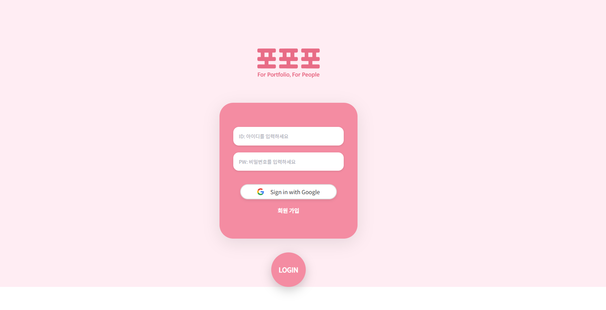

### **회원가입**
- 

### **fopofo 홈**
- 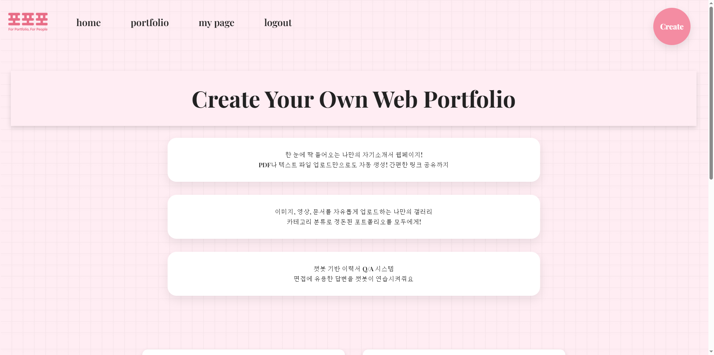
- 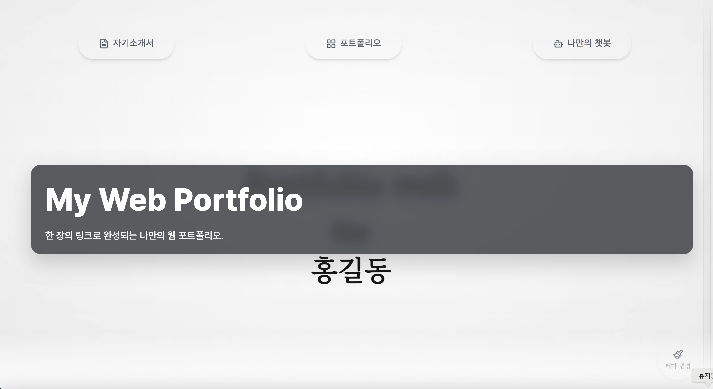

### **닉네임 생성**
- 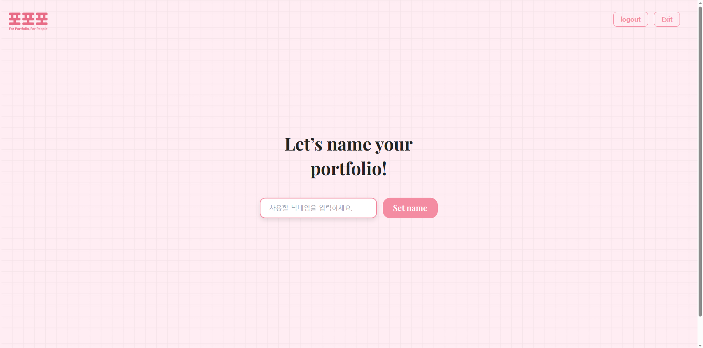

### **자기소개 및 이력서 업로드**
- 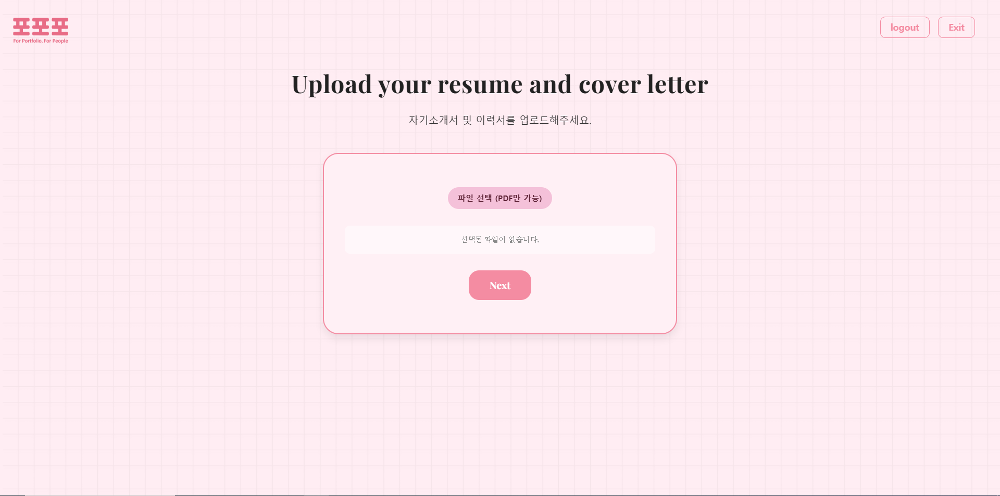

### **다양한 파일 업로드**
- 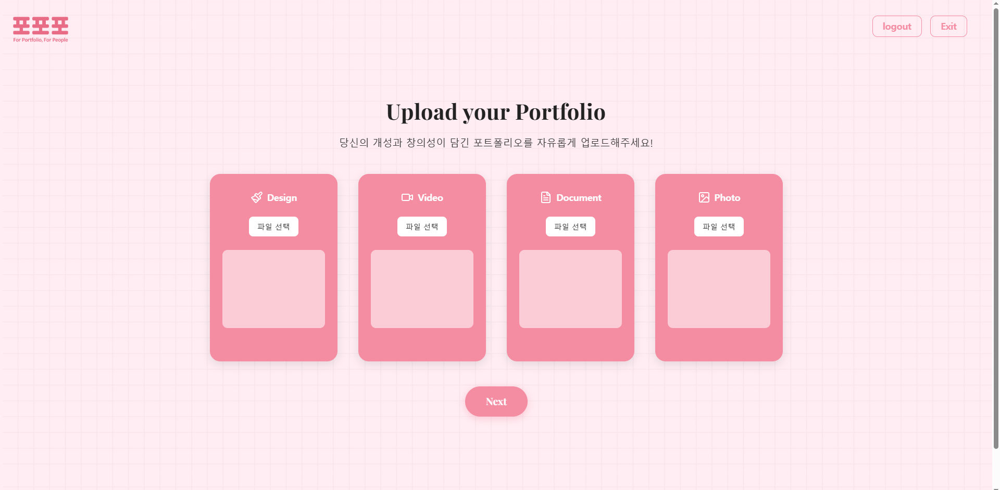

### **챗봇용 자기소개 및 이력서 업로드**
- 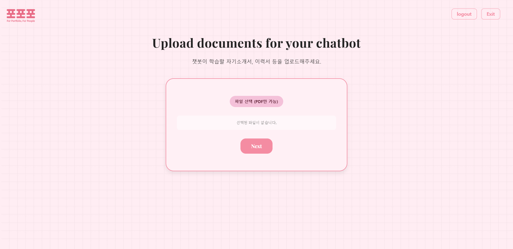

### **챗봇 질문 답변 업로드**
- 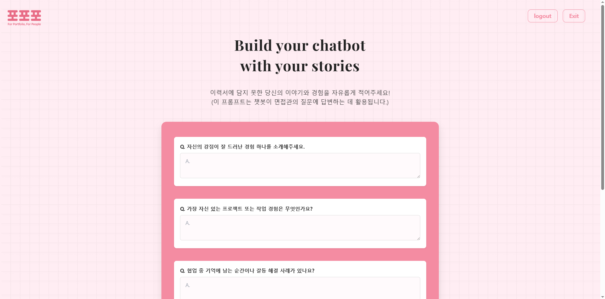
- 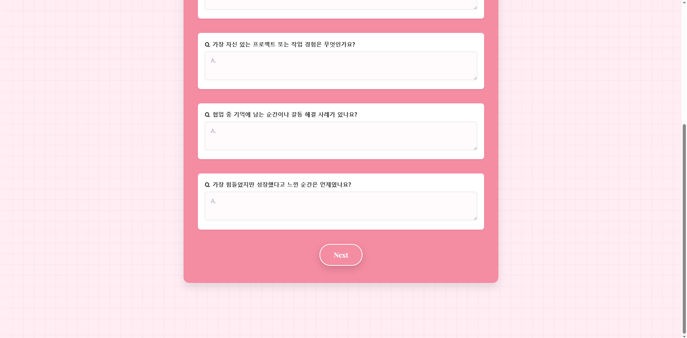

### **공유용 URL 및 QR 코드 생성**
- 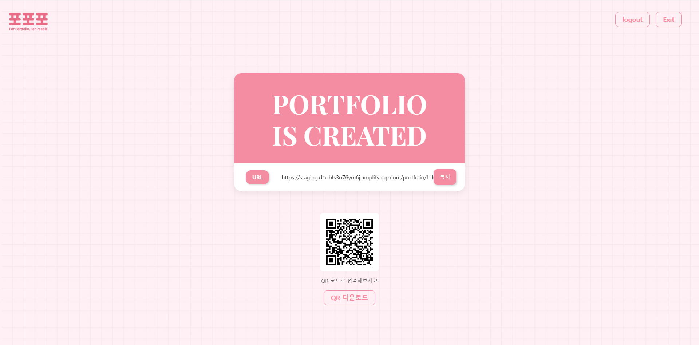

### **공유용 포트폴리오 웹: 홈**
- 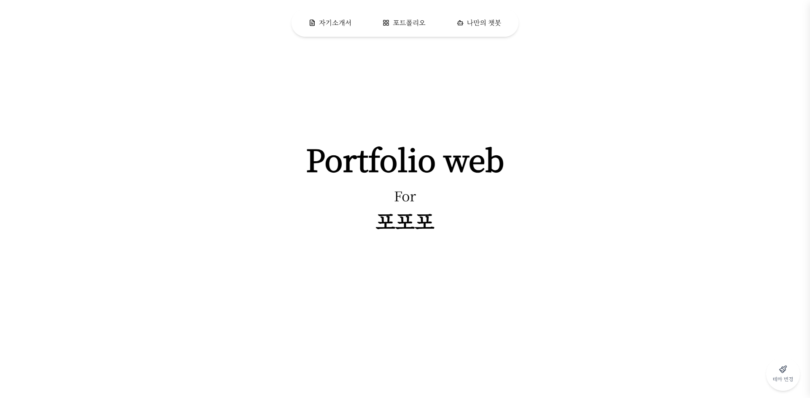

### **공유용 포트폴리오 웹: 테마변경**

### **공유용 포트폴리오 웹: 자기소개서 및 이력서**
- 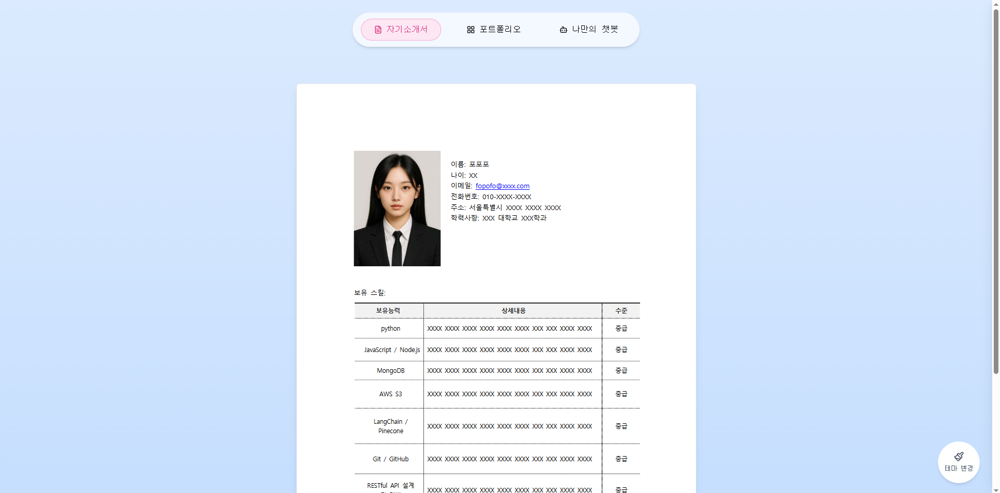
- 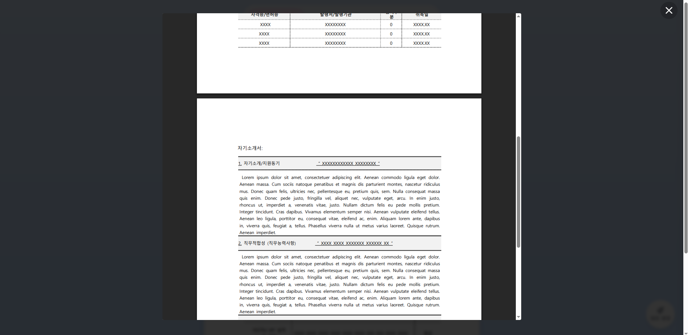

### **공유용 포트폴리오 웹: 포트폴리오**
- 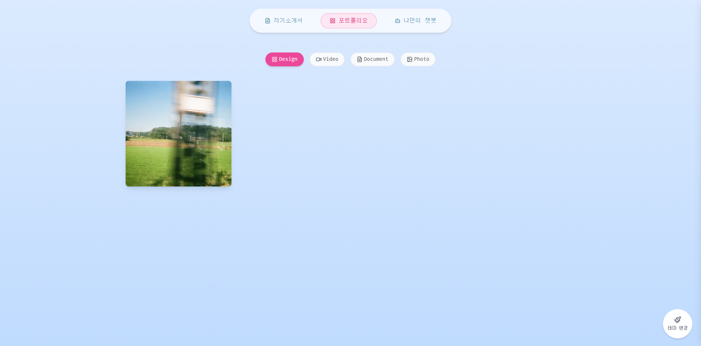

### **공유용 포트폴리오 웹: 나만의 챗봇**
- 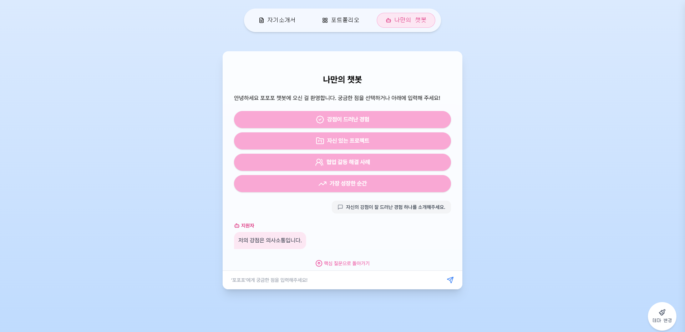
- 챗봇용 자기소개 및 이력서 업로드 문서 기반으로 답변합니다.
- 챗봇의 질문버튼은, 챗봇 질문 답변 업로드 기반으로 답변합니다.

 